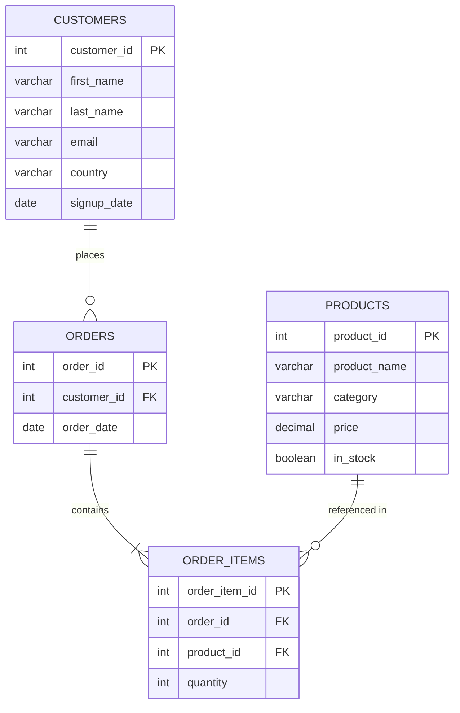

# SQL from Scratch — Hands-On Journey for Data Scientists & Engineers

Welcome to **SQL from Scratch**, a complete, practice-based SQL learning journey designed to take you from **beginner** to **intermediate** level — fully preparing you for SQL-related work as a **Data Scientist** or **Data Engineer**.

This project includes structured modules, real-world datasets, and hands-on exercises using the `sales_company` database.

---

## 1. Project Overview

This repository is part of a complete learning program:
> **Goal:** Build strong, practical SQL skills through guided lessons, interactive challenges, and real-world analytics projects.

You’ll start from the fundamentals and progress toward complex analytical queries, data modeling, and optimization — exactly what’s needed in professional environments.

---

## 2. Program Structure

```
| **Module** | **Focus Area** | **Level** |
|:--:|:--|:--:|
| 1 | SQL Basics and Foundations | 🟢 Beginner |
| 2 | Filtering, Sorting & Expressions | 🟢 Beginner |
| 3 | Aggregation and Grouping | 🟡 Lower-Intermediate |
| 4 | Multi-Table Queries (JOINs) | 🟡 Intermediate |
| 5 | Subqueries, CTEs & Derived Tables | 🟡 Intermediate |
| 6 | Window Functions & Analytics | 🟠 Upper-Intermediate |
| 7 | Data Manipulation (INSERT, UPDATE, DELETE) | 🟡 Intermediate |
| 8 | Data Modeling & Schema Design | 🟡 Intermediate |
| 9 | Performance & Optimization Basics | 🟠 Intermediate |
| 10 | End-to-End Project & Mini-Challenges | 🔵 Applied Practice |
```

---

## 3. Practice Database

The entire program uses a real-world simulation dataset called **`sales_company`**, which models a retail sales environment.

### **Database Schema**
- `customers` — customer details  
- `orders` — customer orders  
- `order_items` — line items for each order  
- `products` — catalog of available products  


### **Relationships**

The logical flow of the database follows the typical structure of a sales system — from customers placing orders, to specific items being ordered, and products being referenced.



### Logical flow

This diagram visually represents how customer purchases relate to orders, order details, and the product catalog.

```
Customers → Orders → Order_Items → Products
```

An ERD (Entity-Relationship Diagram) is included in the **Appendix** section of the project folder.

---

## 4. Learning Outcomes

By completing this hands-on journey, you’ll be able to:

- Write and optimize SQL queries confidently  
- Design and query relational databases  
- Perform data aggregation, analytics, and reporting  
- Apply SQL to real-world data engineering and data science scenarios  
- Understand and visualize database relationships  

---

## 5. Requirements

To follow along locally, install one of the following:

- **MySQL 8.0+**
- **PostgreSQL 14+**
- **SQLite 3+**

Then import the dataset:

```
mysql -u root -p < sales_company.sql
```
---

## 6. Folder Structure

```
SQL-from-Scratch/
│
├── sales_company.sql          # Practice database schema and data
├── README.md                  # Project overview and instructions
├── modules/                   # Hands-on modules and examples
│   ├── module_1_basics.sql
│   ├── module_2_filtering.sql
│   └── ...
│
└── appendix/
    ├── schema_map.txt         # Text-based relational schema
    ├── ERD_light.png          # Light theme ERD
    └── ERD_dark.png           # Dark theme ERD
    
```

---

## 7. Recommended Workflow

```
1. Import the database
2. Follow each module in order
3. Try every exercise before checking solutions
4. Run the end-to-end project to integrate all concepts
```

#### Author

Fataou Maxwell Ouro-Bawinay

#### License

This project is for educational and professional learning use.
Feel free to fork, modify, and practice — but please give credit to the original author when sharing publicly.


---

Would you like me to **add badges** (for language, license, and version) and a **banner image** section at the top to make it look more professional on GitHub?
